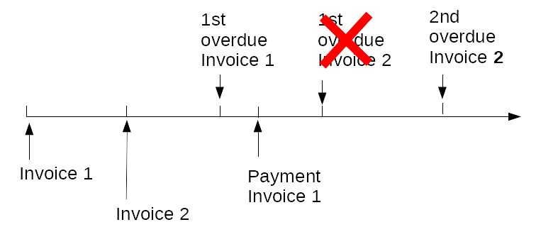

Debtors Management: steps and requirements
==========================================

Debtors Management start: money becomes due
-------------------------------------------

Debtors exist for every organization, company or general purpose alike. Money needs to come in, people or companies that pay late have to be notified etc.

The process starts by money becoming due. At this time the debtor will be notified that money has become due. For the notification making sense to the debtor, it will contain a source of the debt ("You purchased with us...") and the amount(s) that are due.

Payment instructions must also be included. If the debtor has already paid what is due, these will of course differ if payment is to follow during a grace period. Also for different payment methods different instructions may apply.

The notifications in this day and age should include paper invoices, mail communication and list bills. Currently not all will be supported.

The debtor pays: debt reconciliation
------------------------------------

Most debtors pay what is due. That means that at that time the debt is reconciled with the payment and the debt is no longer there. Debt history and payment information is kept for a configurable period. This will enable information to the debtor and will give you insight into how over time your debt position evolved.

Sometimes money paid into the account used to receive the moneys, can not be reconciled automatically. These amounts will be available 

#.  for manual reconciliation 
#.  for returning to the account they were received from.

If an amount is overpaid, it can be returned or kept to reconcile with future payments due. If an amount is not sufficient for paying a debt, it is kept as a credit amount on the invoice, which is of course not considered paid.

.. _overdue_processing:

Non payment: overdue processing
-------------------------------

Debt processing is performed in steps. To ease recognizing the steps, we name them here after the notification produced.

The steps are configurable, but we deliver a sequence as follows:

**first overdue letter**
    after the grace period has passed, a letter will be sent that payment is overdue. This may contain any other debt that is outstanding. It must also contain information for the debtor on what follow ups result after continued non-payment.

**second overdue letter**
    after a specified period a second letter will be sent, setting a date the receivable will be handed over to a debt collecting agency.

**notification of transfer**
    The debtor is notified that the debt is transferred to the debt collecting agency. The debtor is advised that they will be the contact. Payments to the creditor (you) will not be reconciled automatically, as it needs to be handled in conjunction with the agency. After a debt is transferred no invoices can be sent to the debtor!

**Debtor becomes dubious**
    The debt is unlikely to be paid. See :ref:`dubiousdebt`.

Debt processing ends with the payment of the amount of the debt. If more than one invoice was unpaid, debt processing continues. The oldest unpaid invoice is leading. The debtor will receive the documents for the next step at the time appropriate for that invoice.

The 1st overdue action for invoice 2 is missed, because the 1st overdue action for invoice 1 cannot be followed by a 1st overdue again. Optional, you can add a notification detailing the behavior to the reconciliation of the payment for invoice 1.

Would a payment for invoice 2 have been received, the second overdue action would be based on the period invoice 1 was unpaid. However, if invoice 2 is paid, overdue processing continues based on invoice 1.

.. _dubiousdebt:

Lost all hope: dubious debtors
------------------------------

When it is unlikely that the debtor is ever going to pay, the invoice(s) will be made inactive so they will not appear in the debt position. At the same time these will be posted to the ledger as a loss to the organization. This will usually be upon a notification by the debt collection agency, however you may also create a dubious debtor if the amount of the debt is so small it is not worth continuing overdue processing.

If a payment comes in afterwards, this will not be reconciled automatically. The invoice can be reactivated, and the payment reconciled manually. In the ledger, first the debt position is updated from the reactivation, and then the payment is posted.

The debtor is blacklisted. *This may have legal consequences or impediments; verify with your lawyers!*

Changing and removing bills
---------------------------

In exceptional cases bills may be erroneous. If that is the case, bills can be removed. Removing bills will take them out of the debt. Optionally a credit note may be sent to the client to inform the client of the dismissal. Accounting for the bill is reversed.

Changing a bill is done by invalidating the previous bill and generating a new bill:

*   a new bill id is used
*   all lines and the sales date are taken from the old bill, lines may be removed or added
*   a new notification is sent to the client, stating that it supersedes the previous bill
*   Unless overdue processing has already been carried out for another (older) bill, overdue processing is restarted for the new bill
*   Accounting is done for the new bill as usual, the accounting for the old bill is handled as if it was removed.

.. _accountingrules:

How accounting is done
----------------------

For each of the steps accounting is done.

**Amount becomes due**
    When an amount becomes due, the following postings are made:
    
        * unbilled sales - credit for the total amount of the invoice 
        * ordinary debt - debit for the total amount of the invoice 
    
    The split into different kinds of amounts (like tax, commission etc.) is made by the delivering system. Debtors Management is only interested in what is due.

**Bill is removed or replaced**
    When a bill that was billed previously is removed or replaced by a new one, we reverse the accounting done when it became due.
    
        * unbilled sales - debit for the total amount of the invoice 
        * ordinary debt - credit for the total amount of the invoice 

**Payment comes in**
    When an invoice is paid and reconciled, the following postings are made:
    
        * ordinary debt - credit for the total amount of the invoice
        * receipt before reconciliation - debit for the total amount of the invoice
    
        
**A payment is assigned to a bill**
    A payment is meant to pay one or more bills. After assignment of the money to a bill, the amount unreconciled will be lowered by the amount of the assignment.

        * Receipt before reconciliation will be credited for the amount of the assignment
        * Realized income will be debited for the amount of the assignment

**A payment is assigned to another amount to be reconciled**
    This is a transaction that has no financial consequences in total. Yet we will make an accounting entry to make reconciliation of the books possible at the individual transaction level.

        * Receipt before reconciliation will be credited for the amount of the assignment
        * Receipt before reconciliation will be debited for the amount of the assignment

    If the amount being assigned to has a different currency than the amount being assigned, the posting is slightly different.

        * Receipt before reconciliation will be credited for the amount of the assignment (in the payment currency)
        * Currency conversion will be debited for the amount of the assignment (in the payment currency)
        * Currency conversion will be credited for the amount of the assignment (in the target currency)
        * Receipt before reconciliation will be debited for the amount of the assignment (in the target currency)

**Transfer to the debt collector agency**
    The accounting here is dependent on your position as to what the consequences are. You can e.g. post the amount to a special debts account, so reconciliation and success by the agency will be apparent from your books. No posting rules are in the delivered system.

**Debtor becomes dubious**
    When a debt is declared from dubious debtor, the amount is considered a loss:
    
        * ordinary debt - credit for the total amount of the invoice
        * loss to non-payment -  debit for the total amount of the invoice

**Returning amount overpaid**
    When an amount is returned to the debtor it is posted as:
    
        * receipt before reconciliation - debit for the amount to be returned
        * available for crediting - credit for the amount to be returned

Information about individual debtors and debts
----------------------------------------------

It is possible to get information on individual debtors and debts. The information shown:

    * the name (full) and postal adress of the debtor
    * mail addresses of the debtor
    * bank accounts we know of for the debtor
    * the invoices of the debtor; when these were issued and for what amount they were
    * if the invoice was paid
    * if unpaid, at what stage the overdue processing is
    * what overdue notices were sent (medium, date, kind etc.)
    * if any payments were received that are to be reconciled (date of receipt, amount)

This information is on a real-time basis.

Positional debt information: how much? Since when?
--------------------------------------------------

For policy evaluation information is compiled about the debtors in total. No individual debtor info is in this category, but totals. These totals are compiled by time frame (debt "age") and stage of overdue processing.

Information for checking financial position
-------------------------------------------

Total debt and payments to be reconciled are information that are important for financial accountability. This will comprise age reports and the like. Also a report enabling to reconcile financial ledger information with the underlying information is in this category.
